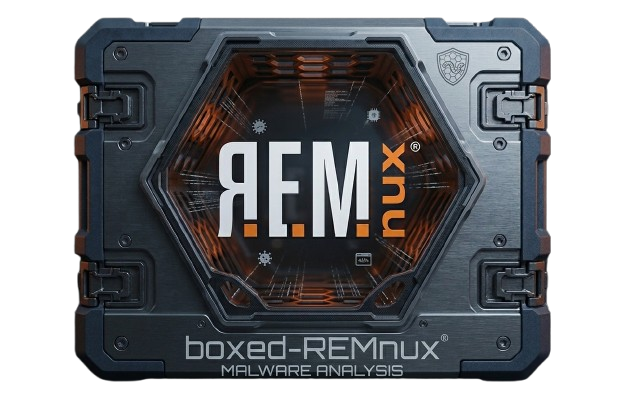
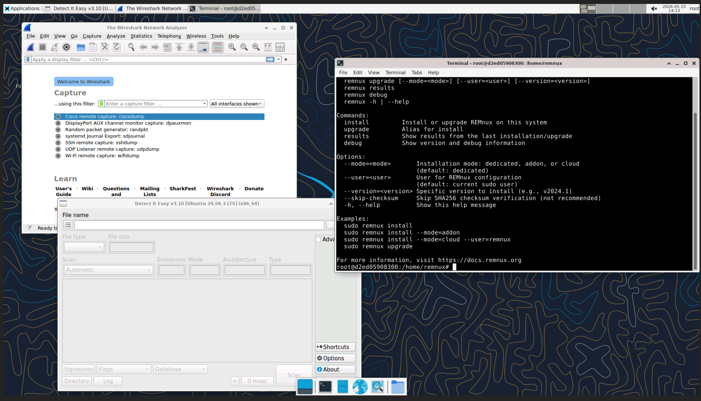

<p align="center">


<br>Boxed REMnux in your Browser

</p>


REMnux malware analysis toolkit in your browser — a Dockerized XFCE desktop with noVNC access.

Built on the official [`remnux/remnux-distro:noble`](https://hub.docker.com/r/remnux/remnux-distro) image with XFCE4, TigerVNC, and noVNC layered on top.

<p align="center">

</p>

## Prerequisites

- [Docker](https://docs.docker.com/get-docker/)
- A browser
- ~15 GB disk space for the image
- At least 4 GB RAM allocated to Docker

## Quick Start

```bash
git clone <your-repo-url> boxed-remnux
cd boxed-remnux

# Build the image
make build

# Start the container
make start

# Open in browser
make browser
```

Or manually:

```bash
docker build -t boxed-remnux .
docker run --rm -d -p 9020:8080 -p 5901:5900 --name boxed-remnux boxed-remnux
```

Then open **http://localhost:9020/vnc.html** and connect with password `remnux`.

## Commands

| Command | Description |
|---------|-------------|
| `make build` | Build the Docker image |
| `make start` | Start container in background |
| `make stop` | Stop and remove container |
| `make browser` | Open noVNC in default browser |
| `make logs` | View container logs |
| `make shell` | Open a bash shell in the running container |
| `make clean` | Remove the Docker image |

## Configuration

Set these environment variables at build time or override at runtime:

| Variable | Default | Description |
|----------|---------|-------------|
| `VNCPWD` | `remnux` | VNC authentication password |
| `VNCDISPLAY` | `1920x1080` | Desktop resolution |
| `VNCDEPTH` | `16` | Color depth (16 or 24) |
| `VNCPORT` | `5900` | VNC server port (container) |
| `NOVNCPORT` | `8080` | noVNC proxy port (container) |
| `VNCEXPOSE` | `1` | Set to `0` for localhost-only VNC |

Override at runtime:

```bash
docker run --rm -d \
  -p 9020:8080 -p 5901:5900 \
  -e VNCPWD=mysecret \
  -e VNCDISPLAY=2560x1440 \
  -e VNCDEPTH=24 \
  --name boxed-remnux boxed-remnux
```

## Sharing Files

Mount a local directory into the container:

```bash
docker run --rm -d \
  -p 9020:8080 -p 5901:5900 \
  -v /path/to/your/files:/home/remnux/files \
  --name boxed-remnux boxed-remnux
```

## Changing Ports

If the default ports conflict, map them differently:

```bash
docker run --rm -d -p 9022:8080 -p 5902:5900 --name boxed-remnux boxed-remnux
# Access at http://localhost:9022/vnc.html
```

## What's Included

All tools from the [REMnux distro](https://remnux.org/), including malware analysis tools for:

- Reverse-engineering (radare2, rizin, Ghidra)
- Document analysis (olevba, oledump)
- Network analysis (Wireshark, tshark)
- Memory analysis (volatility)
- YARA scanning
- And many more

## Architecture Note

The base REMnux image is `linux/amd64`. On Apple Silicon (M-series) Macs, Docker will run it through emulation (Rosetta). Expect slightly slower performance.

## Credits

- [REMnux](https://remnux.org/) by Lenny Zeltser and contributors
- Inspired by [boxed-kali](https://github.com/BenjiTrapp/boxed-kali) by BenjiTrapp
